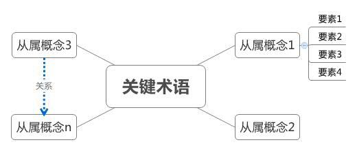

# 论文写作

写作训练是作为学位论文写作和期刊论文写作的一部分，贯穿着研究生教学的全程。另外，如果之后从事科研工作，你会发现学者这一职业并不像传说中的那样轻松。的确，学校有漫长假期，但如影相随的论文发表压力、竞争激烈的职称晋升和接踵而至的教学安排才是学者生活的常态。才华或许很重要，但在漫长的职业生涯中，保持始终阅读、学习和写作的习惯才是第一位的。{{ "Stephen-2011" | cite }}

## 坚持阅读

研究这件事本质上就是一个依托于持续学习、持续输入新知识、持续跟进新方法才能达到产出的过程。读文献、持续读文献、读最新的文献是研究人员应该一辈子坚持去做的事情。事实上，保持大量的、高质量的阅读是写出好文章的必备条件，没有人能绕道而行。

### 期刊论文阅读

阅读期刊论文不应该“以论文为中心”，企图逐篇逐段读懂；而要“以问题为中心”，根据你的阅读能力与掌握问题的能力，由粗而细地阅读与发问，并且从整批相关的论文中寻找问题的答案。

阅读期刊论文的终极目的，是寻找创新与突破的策略，汇整一个研究题目与范围内所涉及的分析与批判的要领，以及从既有的文献里汇整有关研究品质的各种要素，作为后续研究过程的指引和准备。与上述目的关系较远的论文，你只需要概略了解，而不需要事无巨细全部读懂。

当你确定一个研究主题后，首先需要从鸟瞰的角度，宏观了解研究主题内个研究子题之间的关系、既有研究的概略现况，从中找出你认为最有机会创新与突破的焦点，以便进一步针对其中密切相关的关键文献去认真地读通、读透。

## 论文选题

参见[论文选题](topic.html)章节内容

## 文献的查阅及管理

文献类型有书籍、学术杂志、行业杂志、报纸、学位论文、会议论文、国家标准、在线文档、政府报告等等公开出版物。有研究者建议根据具体内容、出版类型和出版时间来组织文献，形成一个有序的分析框架，见下表：{{ "Lawrence-2011" | cite }}

| 时间     | 年                       | 月                       | 星期                                 | 日                       | 即时                       |
| :------- | :----------------------- | :----------------------- | :----------------------------------- | :----------------------- | :------------------------- |
| 资料类型 | 专著                     | 学术杂志                 | 行业杂志                             | 报纸                     | 网页                       |
| 内容类型 | 理论基础、主要概念、架构 | 近期研究、理性讨论、争论 | 现有问题、辩论、应用、实践和专业问题 | 当前问题、争论和专业问题 | 最新问题、争论、实践和应用 |

从上表中我们可以看出，如果我们要查找某一研究主题的理论基础，就应该寻找合适的专著，如果我们要了解当前问题，就不能只看著作。

### 文献查询

想要搜索到所有重要的文献，而且又不会被淹没在一大堆没有参考价值或不相关的文献堆里，有三个关键：（1）找到一组适当的关键词；（2）有效的搜索方法；（3）使用高效的数据库。

首先，用你能想到的关键字去搜索英文版的 [维基百科](https://en.wikipedia.org)，运气好的话，能找到一整篇易读且观点相当完整的词条，在这个词条中，通常还会有数篇相关的学术期刊论文和专著。另外，还会有和这个关键词相关的词条。

其次，使用优秀的学术搜索引擎。随着互联网在学术领域的渗透，涌现出一些优秀好用的综合学术搜索引擎，比如：

1. [谷歌学术](http://scholar.google.com)
2. [SemanticScholar](https://www.semanticscholar.org/)
3. [百度学术](http://xueshu.baidu.com)。

最后，除综合性学术搜索引擎之外，还有一些专门的数据库，比如：

1. [中国知网](http://www.cnki.net)
2. [台湾学术文献数据库](http://www.airitilibrary.cn/)
3. [万方数据](http://www.wanfangdata.com.cn/)
4. [维普网](http://www.cqvip.com/)
5. [SAGE journals](http://online.sagepub.com/)
6. [Willy Online Library](http://onlinelibrary.wiley.com/)
7. [EBSCO](https://www.ebscohost.com/)
8. [Taylor & Francis Online](http://www.tandfonline.com/)
9. [ScienceDirect](http://www.sciencedirect.com/)
10. [牛津大学出版社](http://www.oxfordjournals.org/) 等等。

其他学术数据库和学术搜索引擎可参照 [维基百科上的列表](https://en.wikipedia.org/wiki/List_of_academic_databases_and_search_engines)。

图书应优先在学校图书馆查找，学校图书馆没有收藏的英文书籍可到以下网站搜索：

1. [BookFinder](http://www.bookfinder.com)
1. [b-ok.cc](https://b-ok.cc/)
1. [Library Genesis](http://gen.lib.rus.ec/)
1. [谷歌图书](http://book.google.com)

图书馆没有的中文书籍，可借助于类似与 [新浪微盘](http://vdisk.weibo.com/)、[鸠摩搜索](https://www.jiumodiary.com/) 这样的社会化文件分享工具进行搜寻。最后，还应该利用好 [国家图书馆](http://opac.nlc.cn/F/) 这一优质资源。

虽然文献查询的终极目标是了解某个领域的所有研究成果，但研究人员一定要意识到研究活动不是无期限的，文献查询能掌握特定领域现有知识状况即可。

除了学术搜索引擎、学术数据库之外，还有专门针对科研人员的社交网站，如 [researchgate.net](https://www.researchgate.net/), 可借助这类网站获知你的研究主题的同行信息（只能是参与到这个网站的科研人员）、研究成果（项目、论文），有些论文或著作还可全文下载。

下载英文资料全文，除了正规数据库之外，[sci-hub](https://whereisscihub.now.sh/) 是一个非常给力的工具。

#### 文献搜索小技巧

##### 谷歌学术使用技巧

除了在搜索框直接键入关键词搜索外，还可以使用如下命令：

1. `author:xxx` 搜索 xxx 作者
2. `label:xxx` 搜索某主题的主要作者

借助于这些搜索引擎，研究人员可以快速发现某个研究领域中的主要研究成果和研究人员。

##### caj 格式

cai 格式是中国知网的私有格式，具有无法使用 pdf 阅读器打开的弊端，但在万方数据库中，论文格式全部可以使用 pdf 格式下载，这样就免去了 caj 格式的困扰。

或者直接使用 [cnki 海外版](eng.oversea.cnki.net) 下载。

### 文献筛选

评价文献质量的参考因素有出版机构、研究人员、出版日期、引用次数等信息。

一般而言，出版机构比较重视自身的声誉，对出版物是否出版会有一定的评审，这在一定程度上保证了出版物的质量。因此，出版机构的学术声誉可作为文献筛选的因素之一。比如出版社就有 A、B、C 分类和一至四级的评级；社科类学术杂志可参考 [SSCI](http://wokinfo.com/products_tools/multidisciplinary/webofscience/ssci/)、[CSSCI](http://cssrac.nju.edu.cn/) 等评价标准。具体入选杂志可到相应网页自行查询。新闻传播类的国外 SSCI 和国内 CSSCI 期刊目录可参见之前章节的相应内容。

对研究人员的评价可参考 H 指数。[^1]

文献是否要全文阅读，需要综合判断出版机构的声誉、研究人员的水平以及论文或著作的发表日期和引用次数等等。

### 文献管理

#### 要不要使用文献管理软件

其实，从文献查询开始，研究人员就面临一个问题，即如何将分散于多个渠道（如图书馆、知网、SAGE 等等）的多种类型（如书籍、论文、网页、新闻等等）的材料整合在一起。

当然，我们可以不借助于任何软件来完成这个工作，比如，之前的一些大学者都采用自建读书笔记和读书卡的方式对阅读的材料进行管理。但是从长远看，尽早熟悉一款文献管理软件，会为之后科研工作的效率提升打下很好的基础。

#### 用哪个文献管理软件

文献管理软件，比较知名的有 EndNote、Citation、NoteExpress、CNKI E-Study、Zotero、Paper 等等。这些软件，功能大同小异，普遍能实现文献搜索、批量下载、参考文献管理等等。其中传统的文献管理软件，如 EndNote、NoteExpress、CNKI E-Study，擅长于文献搜索和批量下载，但在处理网页资源时都不太方便。

与 EndNote、EndExpress 等付费商业软件相比，Zotero 具有免费、轻量、方便、便于分享、安全等优势。Zotero 是一款集成在 Firefox、Chrome、Safari 等浏览器的文献管理软件，事实上，我们绝大多数查找资料的任务是在浏览器完成的，当我们在豆瓣或者亚马逊等网站查找书籍、或在谷歌学术中搜索论文、或者在行业新闻网站中浏览网页时发现有用资料时，都可利用 Zotero 方便快速地将其保存为文献资料，尤其是网页快照功能，能将网页作为附件保存到文献资料库中，避免了网页删除、失效的问题。个人认为，Zotero 已经超越了文献管理软件的范畴，更像是一款个人知识积累、管理工具，通过 Zotero 这样一个工具，研究人员能将各种形式的资料整合在一起，从而避免了知识、信息的碎片化。另外，Zotero 中的资料自动同步云端，因而能方便的实现信息的迁移和分享。

##### Zotero 高级技巧

<!-- 先在这里进行必要的积累，等到篇幅合理时，单独成文。 -->

具体 Zotero 的使用可通过 [一个简短视频](http://v.youku.com/v_show/id_XOTY0MDA2NDky.html?from=s1.8-1-1.2) 快速了解。

###### 如何同步附件

当增加的内容较多时，会面临免费空间(10G)可能不够用的问题，解决的方法是将附件和题录分离（Zotfile），然后指定将附件（主要是 pdf）存放到指定的目录。这样我们就可以将独立的目录通过同步工具（如 iCloud、坚果云）进行同步。

###### 如何指定独立附件位置

Zotero 中的 [Zotfile](http://zotfile.com/) 插件，在 Zotero 的基础上，提供了更加令人满意的文件命名和管理功能（重命名、附件位置分离和指定）。

###### 如何判断文献的重要性

可使用插件 [zotero-scholar-citations
](https://github.com/beloglazov/zotero-scholar-citations)，搜索谷歌学术提供的文献被引次数，按照文献被引次数作为文章重要性判断依据之一。需要注意的是，一次不能更新太多数据。

###### 如何设定文献的重要性

可使用标签，如“重要文献”，然后指定颜色和快捷键，如“红色”和 “1”，这样再按键盘上的 `1` 时，当前文献就会增加标签，并设定颜色。

Zotero 参考资料

1. [插件目录](https://www.zotero.org/support/plugins)
1. [官方文档](https://www.zotero.org/support/)

### 文献阅读及组织

文献阅读工作是一个日常性的工作，当然，为了完成特定的任务，可能需要集中一段时间进行大量的文献阅读。通常初学者会一篇一篇文献认真阅读下去，这种方式虽然很踏实，但实际效果并不佳，因为随着文献数量和时间的推移，早期阅读的文献到写作时会变得模糊，需要重新查找和阅读，故而效率不高。

要怎样阅读，才能推动言简意赅的新观点和新评论的形成和完善，菲利普·钟和顺设计了一套阅读、摘记和组织信息的阅读密码表，菲利普认为，写作者卡壳现象的原因，不在于动机不足，而在于写作者在阅读技巧、阅读推进和阅读管理方面的缺陷。{{ "Philip-2015" | cite }}

#### 快速阅读文献

研究者刚刚接触一个新的领域，对许多问题可能还没有什么概念，读起来会十分吃力，但随着阅读量的增加，最后一定会到达融汇贯通的境界。所以，对新手而言，应当重视阅读文献的数量，积累多了，自然就由量变发展为质变了。可以借助于搜索引擎、维基百科、博硕士论文的相应章节，补充背景知识。想要快速阅读文献，首先要花硬功夫，把必备的知识全部放在自己脑子里，只有度过了早期大量阅读文献的阶段，形成了自己的知识树，才会有一定文献甄别能力。除了日常文献阅读工作之外，为了完成特定研究任务，我们必须对查询到的各种文献资料进行取舍，可以用两个标准对文献进行快速阅读：{{ "Lawrence-2011" | cite }}

1. 需要在本研究中包含还是排除掉这个作品？
1. 如果要包含进来，哪些内容是有用的？

#### 组织文献

和文献管理类似，文献阅读也要避免出现上面所述的碎片化问题。研究者应该尽可能地将眼下阅读的材料和已有的知识体系建立联系，即在文献阅读的时候就开始做书面的文献整理及文献综述工作，通过阅读文献，不断地对自己的知识树进行更新、扩充、补缺、修正，进而实现知识迭代，达到掌握特定领域知识现状之目的。

通过文献查询和快速阅读确定了要使用的资料后，我们可以利用思维导图或者类似工具制作核心观点图（如下图），将收集到的资料与研究主题之间建立联系。我们追踪某一领域的研究时，随着时间的推移，资料会越来越多，核心观点图能帮助我们高效、直观地理清众多文献中的概念关系。

#### 精炼主题

通过前面的工作，我们对知识现状有了一个了解。但是，与核心观点相联系的可能有几百种文献和观点，并且每一个子概念都可以成为一个研究项目。这时候，我们必须精炼主题，明确研究选题，其核心是回答这样两个问题：

1. 你真正要研究的是什么？
2. 你不要研究的是什么？

当然，很多方式都可以帮助我们缩小研究课题：限定核心观点、限定具体的理论领域、限定研究范围等等。

[^1]: H 指数是评估研究人员的学术产出数量与学术产出水平的一个混合量化指标。H 指数的计算基于其研究者的论文数量及其论文被引用的次数。一个人在其所有学术文章中有 N 篇论文分别被引用了至少 N 次，他的 H 指数就是 N。谷歌学术、百度学术和中国知网都提供 H 指数查询。
